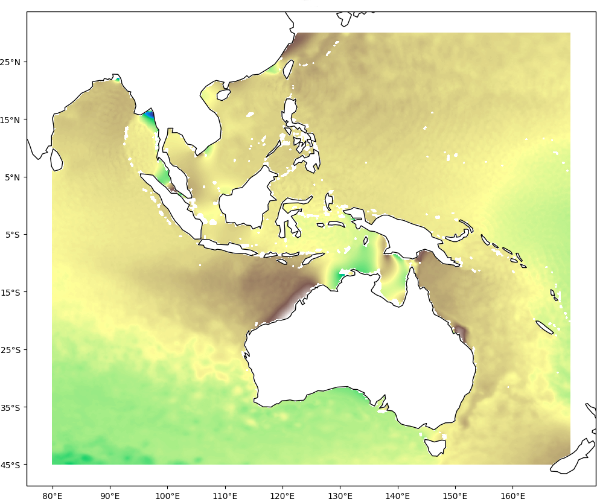
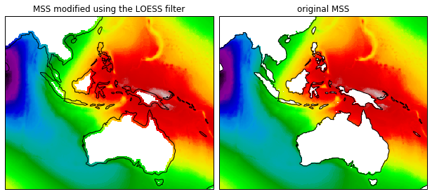
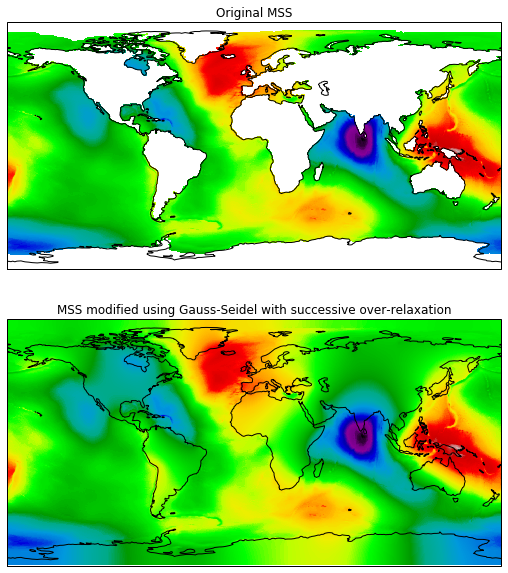
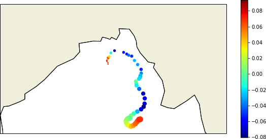

Examples
--------

2D interpolation
================

.. _bivariate:

Bivariate
#########

Perform a bivariate interpolation of gridded data points.

The distribution contains a 2D field ``mss.nc`` that will be used in this help.
This file is located in the ``tests/dataset`` directory at the root of the
project.

.. warning ::

    This file is an old version of the sub-sampled quarter step MSS CNES/CLS. Do
    not use it for scientific purposes, download the latest updated
    high-resolution version instead `here <https://www.aviso.altimetry.fr/en/data/products/auxiliary-products/mss.html>`_.

The first step is to load the data into memory:

.. code:: python

    import netCDF4
    ds = netCDF4.Dataset("tests/dataset/mss.nc")

Afterwards, build the :py:class:`axes <pyinterp.core.Axis>` associated with the
grid:

.. code:: python

    import pyinterp

    x_axis = pyinterp.Axis(ds.variables["lon"][:], is_circle=True)
    y_axis = pyinterp.Axis(ds.variables["lat"][:])

Finally, we can build the object defining the :py:class:`grid
<pyinterp.grid.Grid2D>` to interpolate:

.. code:: python

    # The shape of the bivariate values must be (len(x_axis), len(y_axis))
    mss = ds.variables["mss"][:].T
    # The undefined values must be set to nan.
    mss[mss.mask] = float("nan")
    grid = pyinterp.Grid2D(x_axis, y_axis, mss.data)

We will then build the coordinates on which we want to interpolate our grid:

.. code:: python

    import numpy as np

    # The coordinates used for interpolation are shifted to avoid using the
    # points of the bivariate function.
    mx, my = np.meshgrid(np.arange(-180, 180, 1) + 1 / 3.0,
                         np.arange(-89, 89, 1) + 1 / 3.0,
                         indexing='ij')

The grid is :py:meth:`interpolated <pyinterp.interpolator.bivariate>` to
the desired coordinates:

.. code:: python

    mss = pyinterp.bivariate(
        grid, mx.flatten(), my.flatten()).reshape(mx.shape)

Values can be interpolated with several methods: *bilinear*, *nearest*, and
*inverse distance weighting*. Distance calculations, if necessary, are
calculated using the `Haversine formula
<https://en.wikipedia.org/wiki/Haversine_formula>`_.

An experimental module of the library simplifies the use of the library by
using xarray and CF information contained in dataset. This module
implements all the other interpolators of the regular grids presented below.

.. code:: python

    import pyinterp.backends.xarray
    import xarray as xr

    ds = xr.load_dataset("tests/dataset/mss.nc")
    interpolator = pyinterp.backends.xarray.Grid2D(ds.data_vars["mss"])
    mss = interpolator.bivariate(dict(lon=mx.flatten(), lat=my.flatten()))

Bicubic
#######

Interpolating data points on two-dimensional regular grid. The interpolated
surface is smoother than the corresponding surfaces obtained by bilinear
interpolation. Bicubic interpolation is achieved by spline functions provided
by `GSL <https://www.gnu.org/software/gsl/>`_.

.. warning::

    When using this interpolator, pay attention to the undefined values.
    Because as long as the calculation window uses an indefinite point, the
    interpolator will generate indefinite values. This means that this
    interpolator increases the area covered by the masked values. To avoid this
    behavior, it is necessary to :ref:`pre-process <fill_values>` the grid to
    delete undefined values.

The interpolation :py:meth:`pyinterp.interpolator.bicubic` function has more
parameters in order to define the data frame used by the spline functions and
how to process the edges of the regional grids:

.. code:: python

    mss = pyinterp.bicubic(
        grid, mx.flatten(), my.flatten(), nx=3, ny=3).reshape(mx.shape)

.. warning::

    The grid provided must have strictly increasing axes in order to meet the
    specifications of the GSL library. When building the grid, specify the
    ``increasing_axes`` option to automatically flip the decreasing axes and the
    grid. For example:

    .. code:: python

        interpolator = pyinterp.backends.xarray.Grid2D(
            ds.data_vars["mss"], increasing_axes=True)

It is also possible to simplify the interpolation of the dataset by using
xarray:

.. code:: python

    mss = interpolator.bicubic(dict(lon=mx.flatten(), lat=my.flatten()))

Binning
#######

Statistical data binning is a way to group a number of more or less continuous
values into a smaller number of *bins*. For example, if you have irregularly
distributed data over the oceans, you can organize these observations into a
smaller number of geographical intervals (for example, by grouping them all five
degrees into latitudes and longitudes).

In this example, we will calculate the :py:class:`binning
<pyinterp.binning.Binning2D>` on the MSS grid with boxes of 5 degrees in
latitudes and longitudes.

.. code:: python

    binning = pyinterp.Binning2D(
        pyinterp.Axis(np.arange(-180, 180, 5), is_circle=True),
        pyinterp.Axis(np.arange(-90, 95, 5)))

Then push data into each bin. Here, a :ref:`simple binning <bilinear_binning>`
2D is used but you can also apply a :ref:`linear binning <bilinear_binning>` if
you set the ``simple`` keyword to ``False``.

.. code:: python

    mx, my = np.meshgrid(ds.lon, ds.lat)
    binning.push(mx, my, ds.mss, simple=True)

You can access the different statistical :py:meth:`variables
<pyinterp.binning.Binning2D.variable>` calculated by increment. For example, to
obtain the mean per bin.

.. code:: python

    binning.variable('mean')

3D interpolation
================

Trivariate
##########

The :py:func:`trivariate <pyinterp.interpolator.trivariate>` interpolation
allows to obtain values at arbitrary points in a 3D space of a function defined
on a grid.

The distribution contains a 3D field ``tcw.nc`` that will be used in this help.
This file is located in the ``tests/dataset`` directory at the root of the
project.

This method performs a bilinear interpolation in 2D space by considering the
axes of longitude and latitude of the grid, then performs a linear
interpolation in the third dimension. Its interface is similar to the
:py:func:`bivariate <pyinterp.interpolator.bivariate>` class except for a third
axis which is handled by this object.

.. code:: python

    ds = netCDF4.Dataset("tests/dataset/tcw.nc")
    x_axis = pyinterp.Axis(ds.variables["longitude"][:], is_circle=True)
    y_axis = pyinterp.Axis(ds.variables["latitude"][:])
    z_axis = pyinterp.Axis(ds.variables["time"][:])
    # The shape of the bivariate values must be
    # (len(x_axis), len(y_axis), len(z_axis))
    tcw = ds.variables['tcw'][:].T
    # The undefined values must be set to nan.
    tcw[tcw.mask] = float("nan")
    grid = pyinterp.Grid3D(
        x_axis, y_axis, z_axis, tcw.data)
    # The coordinates used for interpolation are shifted to avoid using the
    # points of the bivariate function.
    mx, my, mz = np.meshgrid(np.arange(-180, 180, 1) + 1 / 3.0,
                             np.arange(-89, 89, 1) + 1 / 3.0,
                             898500 + 3,
                             indexing='ij')
    tcw = pyinterp.trivariate(
        grid, mx.flatten(), my.flatten(), mz.flatten()).reshape(mx.shape)

It is also possible to simplify the interpolation of the dataset by using
xarray:

.. code:: python

    import datetime

    ds = xr.load_dataset("tests/dataset/tcw.nc")
    interpolator = pyinterp.backends.xarray.Grid3D(ds.data_vars["tcw"])

    # Note: if the grid loaded in memory uses a time axis, then dates must be
    # manipulated in the same unit as the one manipulated by the class. The
    # "time_unit" method is used to obtain this information.
    mx, my, mz = np.meshgrid(np.arange(-180, 180, 1) + 1 / 3.0,
                             np.arange(-89, 89, 1) + 1 / 3.0,
                             np.array([datetime.datetime(2002, 7, 2, 15, 0)],
                                      dtype=interpolator.time_unit()),
                             indexing='ij')
    tcw = interpolator.trivariate(
        dict(longitude=mx.flatten(), latitude=my.flatten(), time=mz.flatten()))

Bicubic
#######

This :py:func:`function <pyinterp.interpolator.bicubic>` allows obtaining a
value from any position in a 3D space by a 2D spatial bicubic interpolation
(considering the X and Y axes of the grid), followed by a linear interpolation
along the Z axis of the two values obtained by the bicubic interpolation.

The use of this function is identical to the function presented for
``bivariate`` interpolations except for the type of grid passed as parameter, a
:py:class:`3D grid <pyinterp.grid.Grid3D>`, and the coordinates along the Z
axis. First, the 3D grid is reconstructed using the backend ``xarray``,
requesting axes sorted in ascending order (GSL requirements). 

.. code:: python

    ds = xr.load_dataset("tests/dataset/tcw.nc")
    interpolator = pyinterp.backends.xarray.Grid3D(
        ds.data_vars["tcw"], increasing_axes=True)
    
    tcw = interpolator.bicubic(
        dict(longitude=mx.flatten(), latitude=my.flatten(), time=mz.flatten()))

Unstructured grid
=================

The interpolation of this object is based on an :py:class:`R*Tree
<pyinterp.rtree.RTree>` structure. To begin with, we start by building this
object. By default, this object considers WGS-84 geodetic coordinate system.
But you can define another one using class :py:class:`System
<pyinterp.geodetic.System>`.

.. code:: python

    import pyinterp
    mesh = pyinterp.RTree()

Then, we will insert points into the tree. The class allows you to insert
points using two algorithms. The first one called :py:meth:`packing
<pyinterp.rtree.RTree.packing>` allows you to insert the values in the tree at
once. This mechanism is the recommended solution to create an optimized
in-memory structure, both in terms of construction time and queries. When this
is not possible, you can insert new information into the tree as you go along
using the :py:meth:`insert <pyinterp.rtree.RTree.insert>` method.

.. code:: python

    import intake

    cat_url = "https://raw.githubusercontent.com/pangeo-data/pangeo-datastore" \
        "/master/intake-catalogs/ocean/llc4320.yaml"
    cat = intake.Catalog(cat_url)

    # Grid subsampling (orginal volume is too huge for this example)
    indices = slice(0, None, 8)

    # Reads longitudes and latitudes of the grid
    array = cat.LLC4320_grid.to_dask()
    lons = array["XC"].isel(i=indices, j=indices)
    lats = array["YC"].isel(i=indices, j=indices)

    # Reads SSH values for the first time step of the time series
    ssh = cat.LLC4320_SSH.to_dask()
    ssh = ssh["Eta"].isel(time=0, i=indices, j=indices)

    # Populates the search tree
    mesh.packing(
        np.vstack((lons.values.flatten(), lats.values.flatten())).T,
        ssh.values.flatten())

When the tree is created, you can :py:meth:`interpolate
<pyinterp.rtree.RTree.inverse_distance_weighting>` the data or make various
:py:meth:`queries <pyinterp.rtree.RTree.query>` on the tree.

.. code:: python

    x0, x1 = 80, 170
    y0, y1 = -45, 30
    mx, my = np.meshgrid(
        np.arange(x0, x1, 1/32.0),
        np.arange(y0, y1, 1/32.0),
        indexing="ij")

    eta, neighbors = mesh.inverse_distance_weighting(
        np.vstack((mx.flatten(), my.flatten())).T,
        within=False,
        radius=35434,
        k=8,
        num_threads=0)

The image below illustrates the result:

    Result of the interpolation of the MIG/GCM/LC4320 grid

.. _fill_values:

Fill NaN values
===============

The undefined values in the grids do not allow interpolation of values located
in the neighborhood. This behavior is a concern when you need to interpolate
values near the land/sea mask of some maps. The library provides two functions
to fill the undefined values.

LOESS
#####

The :py:func:`first <pyinterp.fill.loess>` method applies a weighted local
regression to extrapolate the boundary between defined and undefined values. The
user must indicate the number of pixels on the X and Y axes to be considered in
the calculation. For example:

.. code:: python

    # Module that handles the filling of undefined values.
    import pyinterp.fill

    ds = xr.load_dataset("tests/dataset/mss.nc")
    grid = pyinterp.backends.xarray.Grid2D(ds.data_vars["mss"])
    filled = pyinterp.fill.loess(grid, nx=3, ny=3)

The image below illustrates the result:

Gauss-Seidel
############

The :py:func:`second <pyinterp.fill.gauss_seidel>` method consists of replacing
all undefined values (NaN) in a grid using the Gauss-Seidel method by
relaxation. This `link
<https://math.berkeley.edu/~wilken/228A.F07/chr_lecture.pdf>`_ contains more
information on the method used.

.. code:: python

    has_converged, filled = pyinterp.fill.gauss_seidel(grid)

The image below illustrates the result:

Interpolation of a time series
==============================

This example shows how to interpolate a time series using the library.

In this example, we consider the time series of MSLA maps distributed by
AVISO/CMEMS. We start by retrieving the data:

.. code:: python

    cat = intake.Catalog("https://raw.githubusercontent.com/pangeo-data"
                         "/pangeo-datastore/master/intake-catalogs/"
                         "ocean.yaml")
    ds = cat["sea_surface_height"].to_dask()

To manage the time series retrieved, we create the following object:

.. code:: python

    import datetime
    import pandas as pd

    class TimeSeries:
        """Manage a time series composed of a grid stack"""

        def __init__(self, ds):
            self.ds = ds
            self.series, self.dt = self._load_ts()

        @staticmethod
        def _is_sorted(array):
            indices = np.argsort(array)
            return np.all(indices == np.arange(len(indices)))

        def _load_ts(self):
            """Loading the time series into memory."""
            time = self.ds.time
            assert self._is_sorted(time)

            series = pd.Series(time)
            frequency = set(np.diff(series.values.astype("datetime64[s]")).astype("int64"))
            if len(frequency) != 1:
                raise RuntimeError(
                    "Time series does not have a constant step between two "
                    f"grids: {frequency} seconds")
            return series, datetime.timedelta(seconds=float(frequency.pop()))

        def load_dataset(self, varname, start, end):
            """Loading the time series into memory for the defined period.

            Args:
                varname (str): Name of the variable to be loaded into memory.
                start (datetime.datetime): Date of the first map to be loaded.
                end (datetime.datetime): Date of the last map to be loaded.

            Return:
                pyinterp.backends.xarray.Grid3D: The interpolator handling the
                interpolation of the grid series.
            """
            if start < self.series.min() or end > self.series.max():
                raise IndexError(
                    f"period [{start}, {end}] out of range [{self.series.min()}, "
                    f"{self.series.max()}]")
            first = start - self.dt
            last = end + self.dt

            selected = self.series[(self.series >= first) & (self.series < last)]
            print(f"fetch data from {selected.min()} to {selected.max()}")

            data_array = ds[varname].isel(time=selected.index)
            return pyinterp.backends.xarray.Grid3D(data_array)

    time_series = TimeSeries(ds)

The test data set containing a set of positions of different floats is then
loaded.

.. code:: python

    def cnes_jd_to_datetime(seconds):
        """Convert a date expressed in seconds since 1950 into a calendar
        date."""
        return datetime.datetime.utcfromtimestamp(
            ((seconds / 86400.0) - 7305.0) * 86400.0)

    def load_positions():
        """Loading and formatting the dataset."""
        df = pd.read_csv("tests/dataset/positions.csv",
                         header=None,
                         sep=r";",
                         usecols=[0, 1, 2, 3],
                         names=["id", "time", "lon", "lat"],
                         dtype=dict(id=np.uint32,
                                    time=np.float64,
                                    lon=np.float64,
                                    lat=np.float64))
        df.mask(df == 1.8446744073709552e+19, np.nan, inplace=True)
        df["time"] = df["time"].apply(cnes_jd_to_datetime)
        df.set_index('time', inplace=True)
        df["sla"] = np.nan
        return df.sort_index()

    df = load_positions()

Two last functions are then implemented. The first function will divide the
time series to be processed into weeks.

.. code:: python

    def periods(df, time_series, frequency='W'):
        """Return the list of periods covering the time series loaded in
        memory."""
        period_start = df.groupby(
            df.index.to_period(frequency))["sla"].count().index

        for start, end in zip(period_start, period_start[1:]):
            start = start.to_timestamp()
            if start < time_series.series[0]:
                start = time_series.series[0]
            end = end.to_timestamp()
            yield start, end
        yield end, df.index[-1] + time_series.dt

The second one will interpolate the DataFrame loaded in memory.

.. code:: python

    def interpolate(df, time_series, start, end):
        """Interpolate the time series over the defined period."""
        interpolator = time_series.load_dataset("sla", start, end)
        mask = (df.index >= start) & (df.index < end)
        selected = df.loc[mask, ["lon", "lat"]]
        df.loc[mask, ["sla"]] = interpolator.trivariate(dict(
            longitude=selected["lon"].values,
            latitude=selected["lat"].values,
            time=selected.index.values),
            interpolator="inverse_distance_weighting",
            num_threads=0)

Finally, the SLA is interpolated on all loaded floats.

.. code:: python

    for start, end in periods(df, time_series, frequency='M'):
        interpolate(df, time_series, start, end)

The image below illustrates the result for one float:

    Time series of SLA observed by float #62423050
    (larger points are closer to the last date)
